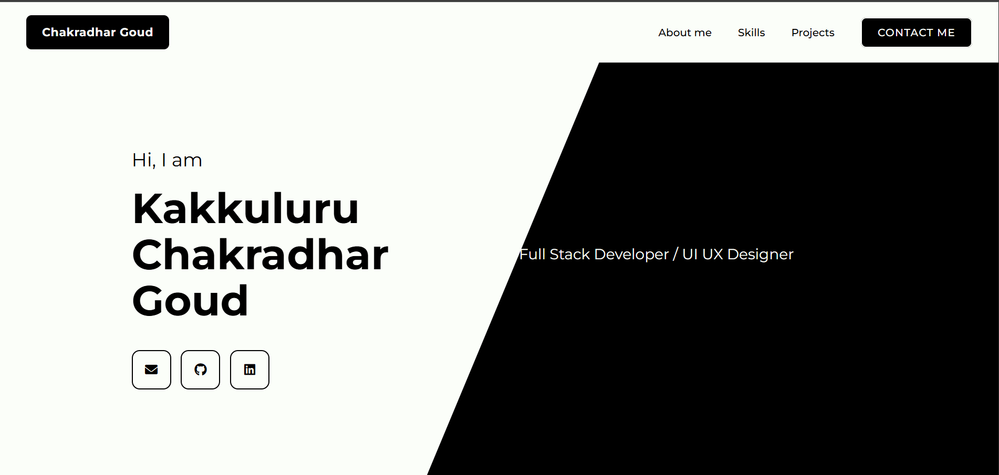

# 💼 Portfolio Website

This is my personal **Portfolio Website** showcasing my skills, projects, and experience as a **Full Stack Developer & UI/UX Designer**.  

## 🚀 Features
- Responsive and modern design  
- Sections: About Me, Skills, Projects, and Contact  
- Social media & GitHub integration  
- Built with **HTML, CSS, and JavaScript**  

## 🛠️ Tech Stack
- **Frontend:** HTML5, CSS3, JavaScript  
- **Design Tools:** Figma  
- **Version Control:** Git & GitHub  

## 📂 Project Structure
```
Portfolio/
│── index.html        # Main HTML file
│── style.css         # Styling
│── script.js         # JavaScript for interactions
│── assets/           # Images & icons
```

## 📸 Preview


## 🔗 Links
- [GitHub](https://github.com/chakradhar2004)  
- [LinkedIn](https://www.linkedin.com/)  
- [Email](mailto:your-email@example.com)  

## ⚡ How to Use
1. Clone the repository:
   ```bash
   https://github.com/chakradhar2004/Portfolio.git
   ```
2. Open `index.html` in your browser.  

## ✨ Future Improvements
- Add more animations and transitions  
- Integrate backend for contact form  
- Host on GitHub Pages / Vercel  

---

👨‍💻 **Developed by:** Kakkuluru Chakradhar Goud
